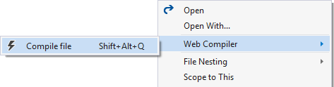
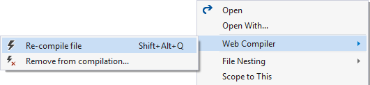
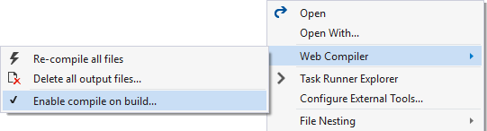
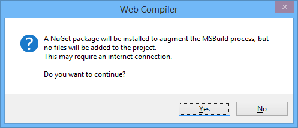
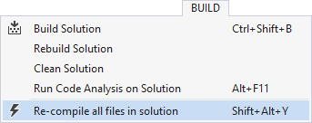
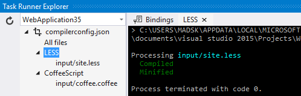
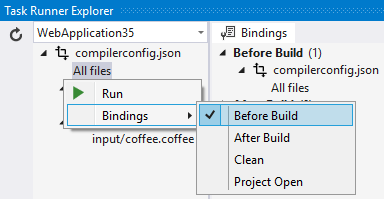
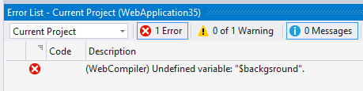

## Web Compiler

A Visual Studio extension that compiles LESS files.

Forked from Jason Moore, removed extra stuff, kept LESS, updated node & node_modules, added sourceMap options.

### Features

- Compilation of LESS files
- Saving a source file triggers re-compilation automatically
- Specify compiler options for each individual file
- Error List integration
- MSBuild support for CI scenarios
- Minify the compiled output
- Shows a watermark when opening a generated file
- Shortcut to compile all specified files in solution
- Task Runner Explorer integration
- Command line interface
- Integrates with [Web Analyzer](https://visualstudiogallery.msdn.microsoft.com/6edc26d4-47d8-4987-82ee-7c820d79be1d)

### Getting started

Right-click any `.less` file in Solution Explorer to setup compilation.



A file called `compilerconfig.json` is created in the root of the
project. This file lets you modify the behavior of the compiler.

Right-clicking the `compilerconfig.json` file lets you easily
run all the configured compilers.



### Compile on save

Any time a `.less` file is modified within Visual Studio, the compiler
runs automatically to produce the compiled output file.

The same is true when saving the `compilerconfig.json` file where
all configured files will be compiled.

### Compile on build / CI support

In ASP.NET MVC and WebForms projects you can enable compilation as part
of the build step. Simply right-click the `compilerconfig.json` file to
enable it.



Clicking the menu item will prompt you with information about what will
happen if you click the OK button.



A NuGet package will be installed into the `packages` folder without adding
any files to the project itself. The NuGet package contains an MSBuild
task that will run the exact same compilers on the `compilerconfig.json`
file in the root of the project.

### Compile all

You can run the compiler on all `compilerconfig.json` files
in the solution by using the keyboard shortcut `Shift+Alt+Y`
or by using the button on the top level Build menu.



### Task Runner Explorer

Get a quick overview of the files you've specified or execute a
compilation directly in Task Runner Explorer.



You can even set bindings so that compilation happens automatically
during certain Visual Studio events, such as *BeforeBuild* and
*Project Open*.



### Error list

When a compiler error occurs, the error list in Visual Studio
will show the error and its exact location in the source file.



### Source maps

Source maps are supported for `.scss` files only for now, but the
plan is to have source map support for all languages. Web Compiler differs from it's predecesor, Web Essentials, in that it inlines a base64 encoded version of the map in the generated .css file rather than producing a separate .map file. 

### compilerconfig.json

The extension adds a `compilerconfig.json` file at the root of the
project which is used to configure all compilation.

Here's an example of what that file looks like:

```json
[
  {
    "outputFile": "output/site.css",
    "inputFile": "input/site.less",
    "minify": {
        "enabled": true
    },
    "includeInProject": true,
    "options":{
        "sourceMap": false
    }
  }
]
```
Default values for `compilerconfig.json` can be found in the `compilerconfig.json.defaults` file in the same location. 